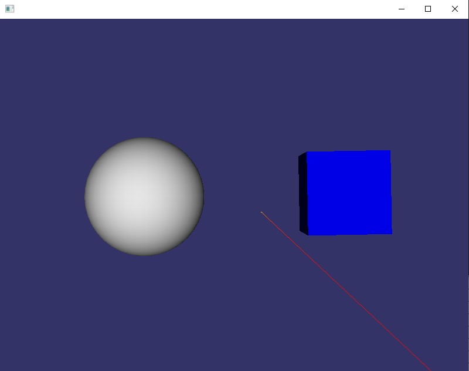

# osg中NDC坐标转换为世界坐标

世界坐标系中的点通过视图矩阵和投影矩阵变换到裁剪空间(Clip space)，再通过透视除法变换为标准化设备坐标（NDC, normalized device coordinate)。NDC是一个长宽高取值都为[-1, 1]的空间，也就是说世界坐标变换为NDC坐标后，x,y,z都在[-1,1]的顶点才是可见的。

## 编译

- `cd cd learn_osg_03`
- `cmake -B build -S . -G "Visual Studio 16 2019"`
- `cmake --build build --config Debug`

## 演示

## 参考

1. [osg中NDC坐标转换为世界坐标](https://blog.csdn.net/forcsdn_tang/article/details/125989895)
